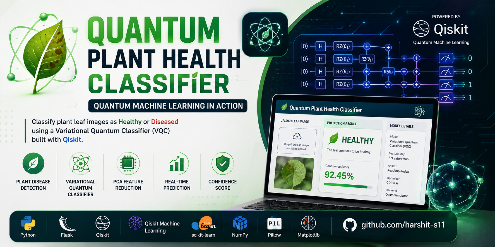

<p align="center">
  
</p>

# Quantum Plant Health Classifier

<p align="center">
  
  
  
  
  
  
  
</p>

---

## Overview

The **Quantum Plant Health Classifier** is a Flask-based web application that classifies plant leaf images as **Healthy** or **Diseased** using a **Variational Quantum Classifier (VQC)** built with **Qiskit** and **Scikit-learn**.

The application bridges classical computer vision techniques with simulated quantum circuits. High-dimensional leaf image data is normalized and reduced via Principal Component Analysis (PCA), encoded into quantum states via parameterized quantum circuits, and evaluated with a variational quantum classification model.

Through an interactive Flask web interface, users can upload plant leaf images to obtain real-time disease predictions along with associated model confidence scores calculated from class probabilities.

---

## Key Features

- **Image Upload Interface**: Clean web UI to select and preview plant leaf images.
- **Automated Preprocessing**: Resizes images to 32×32 RGB, flattens pixel values, and scales to $[0, 1]$.
- **PCA Dimensionality Reduction**: Projects high-dimensional image vectors down to 4 principal components.
- **Quantum Feature Encoding**: Encodes classical feature values into a 4-qubit quantum circuit using `ZZFeatureMap`.
- **Variational Quantum Classifier**: Classifies encoded states using parameterized `RealAmplitudes` ansatz and the `COBYLA` optimizer.
- **Binary Leaf Health Prediction**: Accurately outputs class labels (**Healthy** or **Diseased**).
- **Confidence Scoring**: Returns prediction confidence derived from model output probabilities.
- **Pre-trained Model Loading**: Instant model initialization on startup for fast inference.
- **Standalone Training Pipeline**: Script to train, evaluate, and serialize the quantum model pipeline.

---

## Technology Stack

| Category | Technology | Purpose |
|---|---|---|
| **Language** | Python 3 | Core programming language |
| **Web Framework** | Flask | Web server, routing, and REST endpoints |
| **Quantum Computing** | Qiskit, Qiskit Machine Learning, Qiskit Algorithms | Quantum circuit construction, feature maps, ansatz, and VQC |
| **Classical ML** | Scikit-learn | PCA dimensionality reduction, train/test splitting, accuracy metrics |
| **Image Processing** | Pillow (PIL) | Image loading, resizing, and format conversion |
| **Numerical Computing** | NumPy | Array transformations and mathematical operations |
| **Data Visualization** | Matplotlib | Training and metric visualization support |
| **Frontend** | HTML5, CSS3, Vanilla JavaScript | Responsive user interface and asynchronous image submission |

---

## Machine Learning / Quantum ML Pipeline

```text
Plant Leaf Image (JPG / PNG)
            │
            ▼
 1. Image Preprocessing (Resize to 32×32 RGB, Flatten to 3072 features, Normalize [0, 1])
            │
            ▼
 2. Feature Extraction (Continuous normalized pixel intensity vector)
            │
            ▼
 3. PCA Dimensionality Reduction (3072 features → 4 Principal Components)
            │
            ▼
 4. Quantum Feature Encoding (ZZFeatureMap: 4 Qubits, Reps=1, Linear Entanglement)
            │
            ▼
 5. Variational Quantum Classifier (RealAmplitudes: Reps=2, Linear Entanglement + COBYLA Optimizer)
            │
            ▼
 6. Prediction Output (0: Healthy | 1: Diseased)
            │
            ▼
 7. Confidence Score & JSON Web Response
```

### Detailed Pipeline Stages

1. **Image Preprocessing**: Uploaded images are converted to 3-channel RGB, resized to standard $32 \times 32$ pixels, flattened into a 1D vector of length $32 \times 32 \times 3 = 3072$, and normalized by scaling byte values to $[0.0, 1.0]$.
2. **Feature Extraction**: The flattened pixel intensity array provides continuous spatial-color features representing the leaf sample.
3. **PCA Dimensionality Reduction**: `PCA(n_components=4)` compresses the 3072-dimensional vector down to 4 principal components to match the quantum circuit's 4-qubit register while retaining primary variance.
4. **Quantum Feature Encoding**: The 4 classical principal components are mapped into quantum states using `ZZFeatureMap(feature_dimension=4, reps=1, entanglement='linear')`, creating second-order non-linear feature interactions.
5. **Variational Quantum Classifier (VQC)**: The parameterized circuit uses a `RealAmplitudes(num_qubits=4, reps=2, entanglement='linear')` variational ansatz. During training, classical parameters are optimized using the `COBYLA(maxiter=100)` optimizer via Qiskit's statevector simulator backend.
6. **Prediction**: The trained classifier evaluates the quantum measurement outcomes to produce a binary classification label (`Healthy` vs `Diseased`).
7. **Confidence Score**: The prediction probabilities generated by the classifier are computed to provide confidence feedback to the user.

---

## Application Architecture

- **`vqc_model.py`**: Encapsulates the `PlantHealthClassifier` class, containing preprocessing, PCA transformations, quantum circuit definitions (`ZZFeatureMap` + `RealAmplitudes`), model training, serialization, and inference routines.
- **`app.py`**: The Flask application entry point. Loads the pre-trained `plant_health_model.pkl` on launch, serves the web interface, validates file uploads, delegates inference to the classifier, and safely cleans up temporary upload files.
- **`train_model.py`**: Standalone training CLI. Reads image samples from `Dataset/Tomato_Healthy` and `Dataset/Tomato_diseased`, fits PCA, trains the VQC on a stratified 80/20 train/test split, prints verified accuracy metrics, and saves the model artifact.
- **`templates/index.html`**: Single-page frontend providing drag-and-drop file upload, real-time image preview, model architecture status display, and asynchronous prediction results via `fetch`.

---

## Project Structure

```text
AIproject/
├── app.py                     # Flask web application entry point
├── vqc_model.py               # Variational Quantum Classifier (VQC) implementation
├── train_model.py             # Model training and evaluation script
├── plant_health_model.pkl     # Pre-trained VQC model artifact
├── requirements.txt           # Verified Python project dependencies
├── banner.png                 # Project header visual banner
├── README.md                  # Project documentation
├── .gitignore                 # Git ignore rules for cache and virtualenv
├── templates/
│   └── index.html             # Web user interface template
├── uploads/
│   └── .gitkeep               # Directory for temporary file uploads
└── Dataset/
    ├── Tomato_Healthy/        # Healthy leaf training and validation samples
    └── Tomato_diseased/       # Diseased leaf training and validation samples
```

---

## Installation & Setup

### 1. Clone the Repository

```bash
git clone https://github.com/harshit-s11/AIproject.git
cd AIproject
```

### 2. Create and Activate Virtual Environment

**On Windows (PowerShell):**
```bash
python -m venv venv
venv\Scripts\Activate.ps1
```

**On Linux / macOS:**
```bash
python3 -m venv venv
source venv/bin/activate
```

### 3. Install Dependencies

```bash
pip install -r requirements.txt
```

---

## Usage

### Run the Web Application

```bash
python app.py
```

Open your browser and navigate to:
```text
http://127.0.0.1:5000
```

Upload any leaf image to get an immediate prediction of leaf health status and confidence score.

### Train / Re-train the Model

To train the VQC model from scratch on the dataset:

```bash
python train_model.py
```

This will run the training routine using stratified 80/20 train/test split and update `plant_health_model.pkl`.

---

## Model & Training Configuration

- **Dataset**: Tomato Leaf Dataset (`Healthy` vs `Diseased`)
- **Number of Qubits**: 4
- **PCA Components**: 4
- **Feature Map**: `ZZFeatureMap` (dimension=4, repetitions=1, linear entanglement)
- **Ansatz Circuit**: `RealAmplitudes` (qubits=4, repetitions=2, linear entanglement)
- **Classical Optimizer**: `COBYLA` (maximum iterations=100)
- **Execution Backend**: Qiskit Statevector Simulator (classical simulation of quantum circuit)

---

## Author

**Harshit Sharma**  
B.Tech Computer Science and Engineering  
VIT Chennai  

- **GitHub**: [github.com/harshit-s11](https://github.com/harshit-s11)
- **LinkedIn**: [linkedin.com/in/harshit-sharma24](https://linkedin.com/in/harshit-sharma24)

---

## License

This project is licensed under the MIT License.
